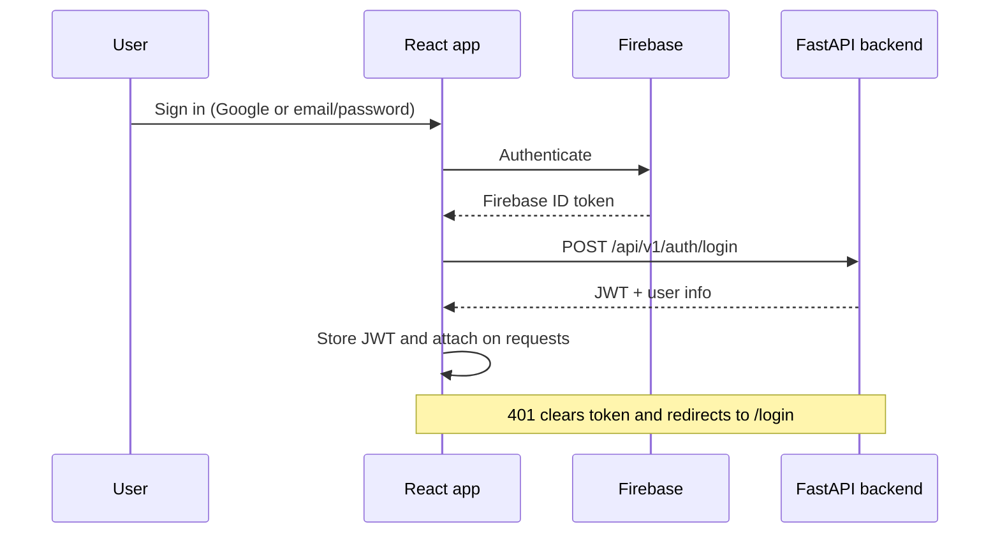
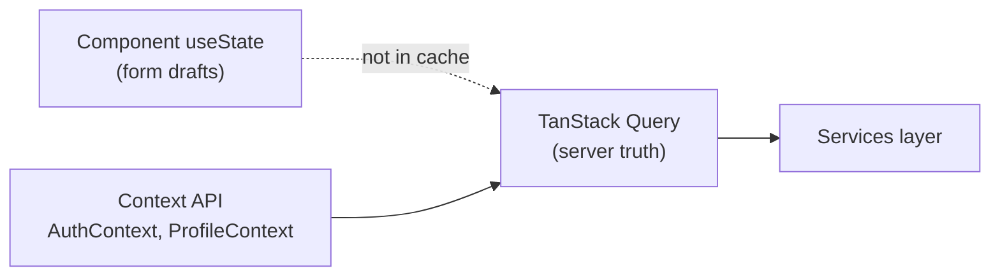
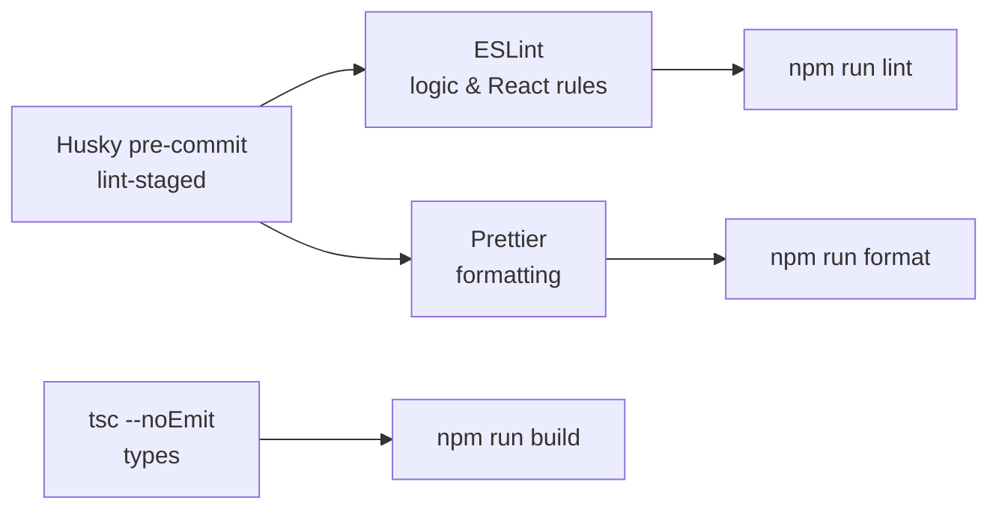

# YARBA Frontend

Frontend for **YARBA** — an AI-powered resume, cover letter, portfolio, and job-application platform.

[](https://github.com/mujakayadan/yarba-frontend/actions/workflows/ci.yml)
[](LICENSE)

## Features

The web app is the primary UI for [yarba-backend](https://github.com/mujakayadan/yarba-backend). Highlights:

| Area                            | What you can do                                                                                                                         |
| ------------------------------- | --------------------------------------------------------------------------------------------------------------------------------------- |
| **Portfolio**                   | Build and edit your career dataset (experience, skills, projects, life story) — the source of truth for all AI output                   |
| **Resumes & cover letters**     | Generate tailored LaTeX PDFs from portfolio + job posting; edit and download                                                            |
| **Job scraping**                | Paste a job URL to extract title and description for resume/cover-letter tailoring                                                      |
| **Applications**                | Track job applications and statuses                                                                                                     |
| **One-click portfolio website** | Choose theme → subdomain → **Create & Deploy** → live site at `{subdomain}.yarba.app`                                                   |
| **Portfolio chatbot**           | Enable an AI assistant on your deployed site (Settings on Website page); uses portfolio + life story; optional Calendly link in profile |
| **Profile & preferences**       | Personal info, life story, LLM/prompt preferences, application settings (for autofill), agent tokens (PATs)                             |
| **Onboarding**                  | Guided setup: personal info, portfolio upload/review, life story, preferences                                                           |

Browser **auto-apply** (Playwright agent) runs via the backend CLI (`scripts/apply.py`) — see the [backend AGENTS.md](https://github.com/mujakayadan/yarba-backend/blob/main/AGENTS.md). The dashboard exposes agent tokens and application settings that feed that workflow.

## Related repositories

| Repo                 | URL                                                                                    |
| -------------------- | -------------------------------------------------------------------------------------- |
| Frontend (this repo) | [github.com/mujakayadan/yarba-frontend](https://github.com/mujakayadan/yarba-frontend) |
| Backend              | [github.com/mujakayadan/yarba-backend](https://github.com/mujakayadan/yarba-backend)   |

```bash
# Frontend
git clone https://github.com/mujakayadan/yarba-frontend.git

# Backend
git clone https://github.com/mujakayadan/yarba-backend.git
```

## Prerequisites

- Node.js 24+
- npm 8+
- [YARBA backend](https://github.com/mujakayadan/yarba-backend) running locally or deployed
- A Firebase project with Authentication enabled

## Setup

```bash
git clone https://github.com/mujakayadan/yarba-frontend.git
cd yarba-frontend
npm install
cp .env.example .env.local
```

Edit `.env.local` with your backend URL (e.g. `http://localhost:8000/api/v1`) and Firebase web app config from the Firebase Console. See the [backend README](https://github.com/mujakayadan/yarba-backend) and [Firebase setup guide](https://github.com/mujakayadan/yarba-backend/blob/main/docs/firebase_setup.md) for API and authentication setup.

See [SECURITY.md](./SECURITY.md) for guidance on credentials and Firebase setup.

## Scripts

| Command                     | Description                      |
| --------------------------- | -------------------------------- |
| `npm start` / `npm run dev` | Vite dev server (port 3000)      |
| `npm run build`             | Type-check + production build    |
| `npm run preview`           | Preview production build locally |
| `npm test`                  | Run Vitest tests                 |
| `npm run lint`              | ESLint                           |
| `npm run format`            | Prettier (write)                 |
| `npm run format:check`      | Prettier (check only)            |

## Stack

YARBA frontend is a **React + TypeScript** SPA built with **Vite**, styled with **MUI**, and wired to a **FastAPI** backend and **Firebase** auth. See [`.cursorrules`](./.cursorrules) for detailed coding conventions.

### Architecture overview


### Authentication flow



### Core libraries

| Layer          | Technology                   | Notes                                                           |
| -------------- | ---------------------------- | --------------------------------------------------------------- |
| UI             | React 19, TypeScript 7       | Functional components; strict typing                            |
| Build          | Vite 8                       | Dev server on port 3000; `tsc --noEmit` on build                |
| Components     | Material UI 7, Emotion       | MUI only for UI; use `Grid` from `src/mui/Grid.tsx`             |
| Routing        | React Router 7               | Pages under `src/pages/`                                        |
| Server state   | TanStack Query 5             | Hooks in `src/hooks/`; keys in `src/lib/queryKeys.ts`           |
| HTTP           | Axios                        | All API calls via `src/services/` — not raw axios in components |
| Auth           | Firebase 12                  | Google + email/password; backend validates tokens               |
| PDF / markdown | react-pdf 10, react-markdown | Resume/cover letter preview                                     |
| Env            | `VITE_*`                     | Loaded via `src/config/env.ts`                                  |

### Backend & related repos

| Piece                                                         | Stack                       | Role                                                |
| ------------------------------------------------------------- | --------------------------- | --------------------------------------------------- |
| [yarba-backend](https://github.com/mujakayadan/yarba-backend) | FastAPI                     | REST API (`VITE_API_URL`); JWT after Firebase login |
| API contracts                                                 | `src/types/models.ts`       | TypeScript shapes aligned with backend schemas      |
| Docs                                                          | `docs/api_documentation.md` | Endpoint reference                                  |

### State management



- **Local state first** — `useState` for UI and in-progress edits.
- **No Redux/Zustand** — keep global state minimal.
- **Contexts** — auth and profile only where many routes need the same data.
- **Query cache** — fetched API data; invalidate after mutations. Do not duplicate fetch logic with `useEffect` + `useState` when a hook already exists.

### Project layout

```
src/
  components/   # auth, common, layout, portfolio, profile, …
  contexts/     # AuthContext, ProfileContext
  hooks/        # TanStack Query hooks (useUserProfile, useResumes, …)
  lib/          # queryKeys.ts
  pages/        # route-level screens
  services/     # Axios API modules
  types/        # models.ts and feature types
  utils/        # auth helpers, formatters, …
```

### Lint & format

**Stack: ESLint + Prettier** (separate tools). TypeScript types stay on `tsc` (`npm run build`), not ESLint.



| Tool                    | Config                                            | Role                                                       |
| ----------------------- | ------------------------------------------------- | ---------------------------------------------------------- |
| **ESLint**              | `eslint.config.js` (ESLint 9 + typescript-eslint) | `npm run lint`                                             |
| **Prettier**            | `.prettierrc`, `.prettierignore`                  | `npm run format` / `npm run format:check`                  |
| **Husky + lint-staged** | `.husky/pre-commit`                               | On `git commit`: format and `eslint --fix` on staged files |

After `npm install`, the `prepare` script registers Git hooks automatically.

**Editor:** ESLint extension for diagnostics; Prettier as default formatter with format-on-save.

CI runs `npm run lint`, `npm run format:check`, `npm run build`, and `npm test`
for every pull request and push to `main`.

### Other quality tooling

| Tool         | Command / usage                                                                        |
| ------------ | -------------------------------------------------------------------------------------- |
| TypeScript 7 | `npm run build` runs `tsc --noEmit` (ESLint still uses the TypeScript 6 API until 7.1) |
| Tests        | `npm test` — Vitest + Testing Library                                                  |

## Deployment

Configured for **Vercel**. Set all `VITE_*` environment variables in the Vercel project settings. Production builds run strict TypeScript checking.

## Development tools

See [TROUBLESHOOTING.md](./TROUBLESHOOTING.md) for common auth, API, env, and debug issues.

## Documentation and contributing

- [API reference](docs/api_documentation.md)
- [Data models](docs/data_models.md)
- [Security policy](SECURITY.md)
- [Contributing guide](CONTRIBUTING.md)
- [Code of Conduct](CODE_OF_CONDUCT.md)
- [Agent guide](AGENTS.md)

## License

This project is licensed under the [Elastic License 2.0](./LICENSE) (ELv2). The source is available for use, study, and contribution, but you may not provide it to third parties as a hosted or managed service that offers a substantial set of YARBA’s features. Third-party dependencies retain their own licenses.
