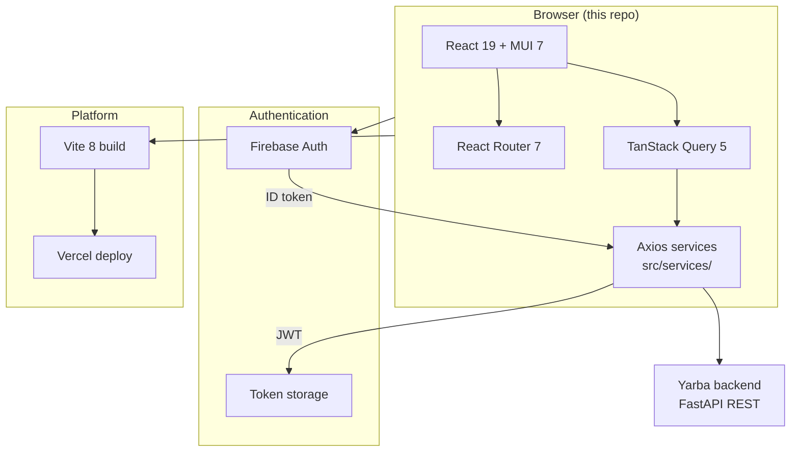
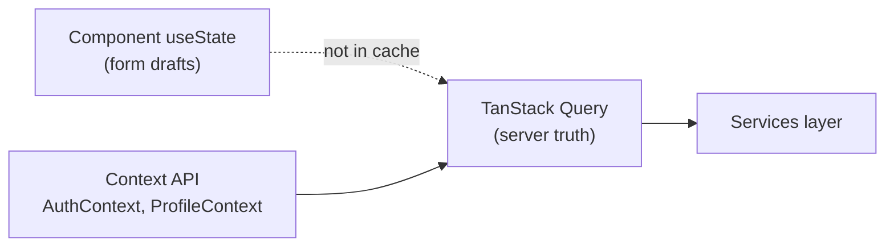
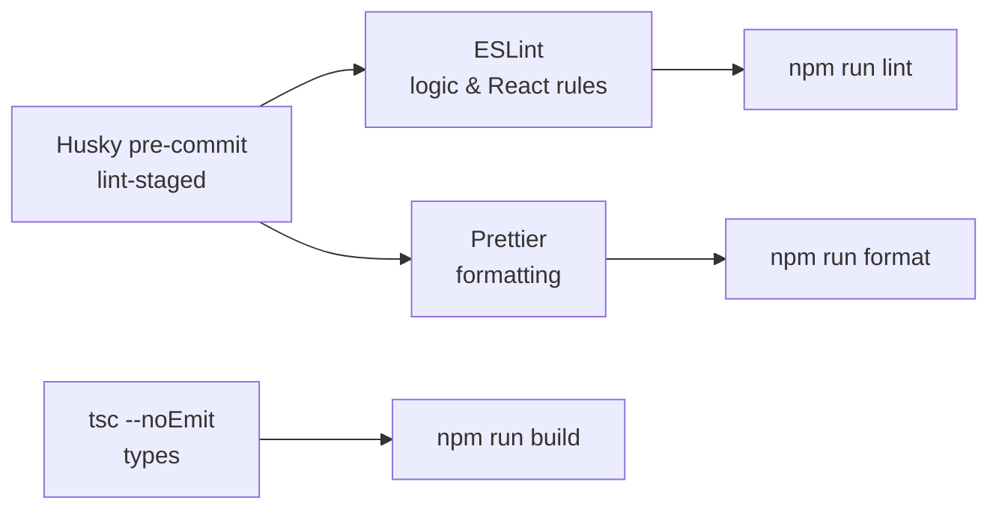

# Yarba Frontend

Frontend for **Yarba** — an AI-powered resume, cover letter, and portfolio platform.

## Related repositories

| Repo                 | URL                                                                                          |
| -------------------- | -------------------------------------------------------------------------------------------- |
| Frontend (this repo) | [github.com/mucahitkayadan/yarba-frontend](https://github.com/mucahitkayadan/yarba-frontend) |
| Backend              | [github.com/mucahitkayadan/yarba-backend](https://github.com/mucahitkayadan/yarba-backend)   |

```bash
# Frontend
git clone https://github.com/mucahitkayadan/yarba-frontend.git

# Backend
git clone https://github.com/mucahitkayadan/yarba-backend.git
```

## Prerequisites

- Node.js 24+
- npm 8+
- [Yarba backend](https://github.com/mucahitkayadan/yarba-backend) running locally or deployed
- A Firebase project with Authentication enabled

## Setup

```bash
git clone https://github.com/mucahitkayadan/yarba-frontend.git
cd yarba-frontend
npm install
cp .env.example .env.local
```

Edit `.env.local` with your backend URL (e.g. `http://localhost:8000/api/v1`) and Firebase web app config from the Firebase Console. See the [backend README](https://github.com/mucahitkayadan/yarba-backend) for API setup.

See [SECURITY.md](./SECURITY.md) for guidance on credentials and Firebase setup.

## Scripts

| Command                     | Description                      |
| --------------------------- | -------------------------------- |
| `npm start` / `npm run dev` | Vite dev server (port 3000)      |
| `npm run build`             | Type-check + production build    |
| `npm run preview`           | Preview production build locally |
| `npm test`                  | Run Vitest tests                 |
| `npm run lint`              | ESLint                           |
| `npm run format`            | Prettier (write)                 |
| `npm run format:check`      | Prettier (check only)            |

## Stack

Yarba frontend is a **React + TypeScript** SPA built with **Vite**, styled with **MUI**, and wired to a **FastAPI** backend and **Firebase** auth. See [`.cursorrules`](./.cursorrules) for detailed coding conventions.

### Architecture overview



### Authentication flow

```mermaid
sequenceDiagram
  participant User
  participant App as React app
  participant FB as Firebase
  participant API as FastAPI backend

  User->>App: Sign in (Google or email/password)
  App->>FB: Authenticate
  FB-->>App: Firebase ID token
  App->>API: POST /api/v1/auth/login
  API-->>App: JWT + user info
  App->>App: Store JWT; attach on requests
  Note over App,API: 401 clears token and redirects to /login
```

### Core libraries

| Layer          | Technology                   | Notes                                                           |
| -------------- | ---------------------------- | --------------------------------------------------------------- |
| UI             | React 19, TypeScript 5       | Functional components; strict typing                            |
| Build          | Vite 8                       | Dev server on port 3000; `tsc --noEmit` on build                |
| Components     | Material UI 7, Emotion       | MUI only for UI; use `Grid` from `src/mui/Grid.tsx`             |
| Routing        | React Router 7               | Pages under `src/pages/`                                        |
| Server state   | TanStack Query 5             | Hooks in `src/hooks/`; keys in `src/lib/queryKeys.ts`           |
| HTTP           | Axios                        | All API calls via `src/services/` — not raw axios in components |
| Auth           | Firebase 12                  | Google + email/password; backend validates tokens               |
| PDF / markdown | react-pdf 10, react-markdown | Resume/cover letter preview                                     |
| Env            | `VITE_*`                     | Loaded via `src/config/env.ts`                                  |

### Backend & related repos

| Piece                                                            | Stack                       | Role                                                |
| ---------------------------------------------------------------- | --------------------------- | --------------------------------------------------- |
| [yarba-backend](https://github.com/mucahitkayadan/yarba-backend) | FastAPI                     | REST API (`VITE_API_URL`); JWT after Firebase login |
| API contracts                                                    | `src/types/models.ts`       | TypeScript shapes aligned with backend schemas      |
| Docs                                                             | `docs/api_documentation.md` | Endpoint reference                                  |

### State management



- **Local state first** — `useState` for UI and in-progress edits.
- **No Redux/Zustand** — keep global state minimal.
- **Contexts** — auth and profile only where many routes need the same data.
- **Query cache** — fetched API data; invalidate after mutations. Do not duplicate fetch logic with `useEffect` + `useState` when a hook already exists.

### Project layout

```
src/
  components/   # auth, common, layout, portfolio, profile, …
  contexts/     # AuthContext, ProfileContext
  hooks/        # TanStack Query hooks (useUserProfile, useResumes, …)
  lib/          # queryKeys.ts
  pages/        # route-level screens
  services/     # Axios API modules
  types/        # models.ts and feature types
  utils/        # auth helpers, formatters, …
```

### Lint & format

**Stack: ESLint + Prettier** (separate tools). TypeScript types stay on `tsc` (`npm run build`), not ESLint.



| Tool                    | Config                                                               | Role                                                       |
| ----------------------- | -------------------------------------------------------------------- | ---------------------------------------------------------- |
| **ESLint**              | `.eslintrc.cjs`, `eslint-config-react-app`, `eslint-config-prettier` | `npm run lint`                                             |
| **Prettier**            | `.prettierrc`, `.prettierignore`                                     | `npm run format` / `npm run format:check`                  |
| **Husky + lint-staged** | `.husky/pre-commit`                                                  | On `git commit`: format and `eslint --fix` on staged files |

After `npm install`, the `prepare` script registers Git hooks automatically.

**Editor:** ESLint extension for diagnostics; Prettier as default formatter with format-on-save.

**CI (optional):** `npm run lint && npm run format:check && npm run build`

### Other quality tooling

| Tool       | Command / usage                       |
| ---------- | ------------------------------------- |
| TypeScript | `npm run build` runs `tsc --noEmit`   |
| Tests      | `npm test` — Vitest + Testing Library |

Forms: [`.cursorrules`](./.cursorrules) recommends **Formik + Yup** for new forms; adopt when adding complex validation (not currently in `package.json`).

## Deployment

Configured for **Vercel**. Set all `VITE_*` environment variables in the Vercel project settings. Production builds run strict TypeScript checking.

## Development tools

The Firebase debug page at `/firebase-test` is available only in development mode (`npm run dev`).

## License

MIT — see [LICENSE](./LICENSE).
